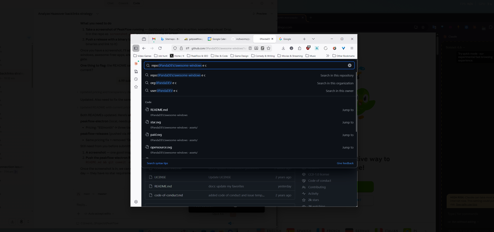
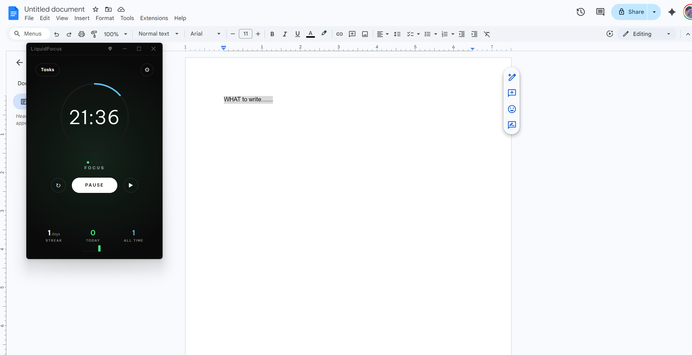
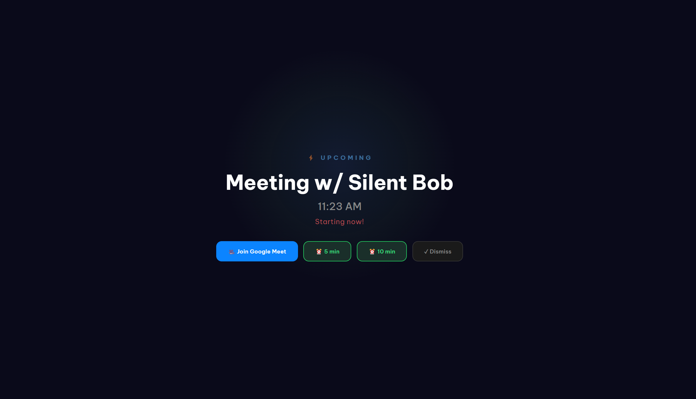

# PeakFlow

Mac-level productivity tools for Windows. six tools that run from the system tray.

[Download](https://github.com/inchwormz/peakflow-releases/releases/latest) · [Website](https://getpeakflow.pro) · [Blog](https://getpeakflow.pro/blog/)

**FocusDim** ... dims everything except the active window



**Liquid Focus** ... Pomodoro timer with webcam focus detection



**ScreenSlap** ... full-screen meeting alert with one-click join



## What's in it

| Tool | What it does |
|------|-------------|
| **FocusDim** | Dims every window except the one you're working in. Multi-monitor. |
| **QuickBoard** | Clipboard manager. Stores 100+ items, full-text search, auto-paste. |
| **Liquid Focus** | Pomodoro timer with Todoist integration and webcam focus detection. |
| **SoundSplit** | Per-app volume sliders with real-time VU meters. |
| **ScreenSlap** | Full-screen meeting alerts from Google Calendar. One-click join for Zoom, Meet, Teams, Webex. |
| **MeetReady** | Camera and mic check before meetings. Shows video preview, mic levels, lighting quality. |
| **Dashboard** | Hub that launches everything else. Install only the tools you want. |

FocusDim and SoundSplit use Win32 APIs directly through FFI (koffi), not Electron overlays. The webcam focus tracker runs TensorFlow.js face detection on-device. Nothing leaves your machine.

## Tech stack

- Electron 33 + React 19 + TypeScript 5.7
- Vite 6 via electron-vite
- Tailwind CSS 4
- koffi (FFI for Win32: `GetForegroundWindow`, `DwmGetWindowAttribute`, `SendInput`)
- TensorFlow.js + BlazeFace (on-device face detection)
- PowerShell sidecar for WASAPI audio control (SoundSplit)

## Setup

```bash
git clone https://github.com/inchwormz/peakflow-electron.git
cd peakflow-electron
npm install
```

Copy the env template and add your own API credentials:

```bash
cp .env.example .env
```

You need a Todoist app and Google OAuth client if you want calendar/task integrations. Both use PKCE, so no client secret is needed for Google. The Todoist secret goes in `.env`.

Start the dev server:

```bash
npm run dev
```

## Build

```bash
npm run build:win    # NSIS installer → release/
npm run build:unpack # Unpacked build for testing → release/win-unpacked/
npm run typecheck    # Check types (main + renderer)
npm run lint         # ESLint
```

## Project structure

```
src/
├── main/           # Electron main process
│   ├── services/   # Business logic per tool (focus-dim.ts, clipboard.ts, etc.)
│   ├── native/     # Win32 FFI bindings
│   ├── security/   # Trial and licensing
│   └── sidecar/    # PowerShell audio bridge
├── preload/        # contextBridge API
├── renderer/       # React UI
│   └── src/tools/  # One component per tool
└── shared/         # IPC types and tool definitions
```

## Contributing

Open an issue before submitting a PR. Bug reports and feature requests are welcome.

If you're adding a new tool, follow the existing pattern: service in `src/main/services/`, IPC channels in `ipc-handlers.ts`, React component in `src/renderer/src/tools/`.

## License

GPL v3. See [LICENSE](LICENSE).

14-day free trial, no credit card required.

- **$6.99/month** ... all 7 tools, cancel anytime
- **$9.99** ... one tool, yours forever (v1)
- **$49.99** ... all 7 tools, yours forever (v1)

Purchase at [getpeakflow.pro](https://getpeakflow.pro).

The code is open because PeakFlow touches your screen, mic, and clipboard. You should be able to read what it does.
